# Hacer backup del sitio web
Antes de comenzar como requisito debemos tener instalado un cliente FTP como FileZilla (que puedes instalar siguiendo esta, [guía](https://kiryeelesion.github.io/instalar-filezilla-windows/ "Instalar FileZilla en Windows"))

## Generar backup

Para realizar un backup completo de un sitio web, lo primero que debemos hacer es ingresar al cliente, a través del enlace al servidor que tiene una estructura similar a https://IP:8888, donde veremos la pantalla de inicio de sesión:

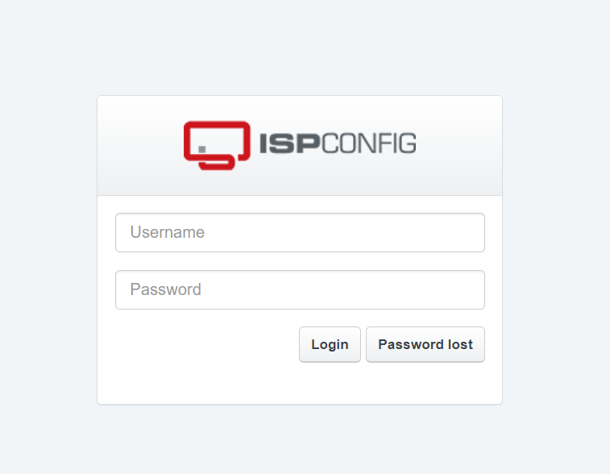

Ingresamos las credenciales de administrador (que recibimos al momento de solicitar el servicio de hosting). Al ingresar veremos el panel principal.

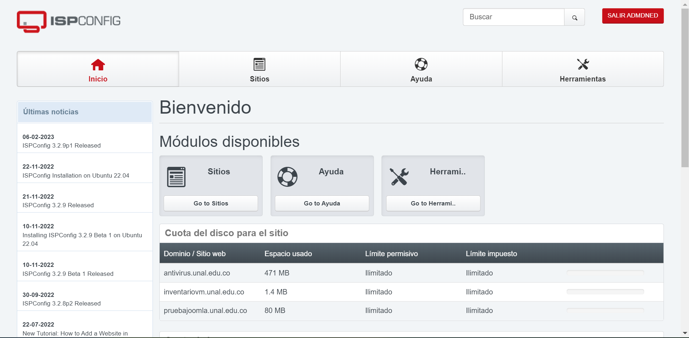

Nos dirigimos a la pestaña de sitios, donde seleccionaremos el sitio al que le queremos realizar la copia de seguridad.

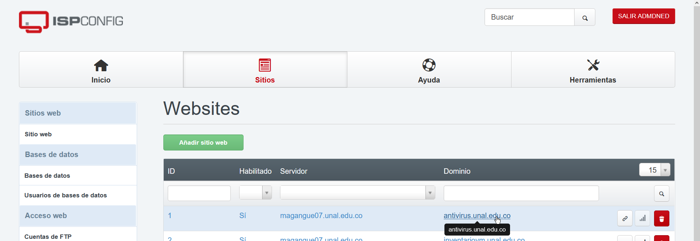

Una vez se abran las configuraciones del sitio, nos dirigimos a la pestaña de *Backup*.

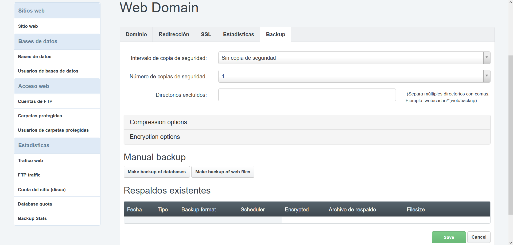

En la sección *Manual backup* encontramos los botones de ***Make backup of databeses*** y ***Make backup of web files*** que presionaremos para generar la copia correspondiente (El primer botón genera un backup de la base de datos, que para sitios que no necesitan base de datos no es necesario presionar y el segundo genera un backup de todos los archivos del sitio, como imágenes, o archivos HTML).

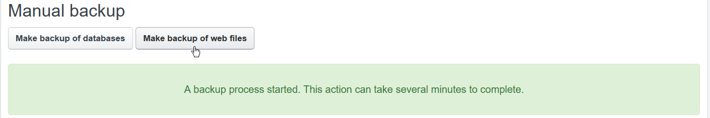

Dependiendo del tamaño del sitio tendremos mayor o menor tiempo de espera para ser generados. Una vez termine de generar la copia de seguridad nos aparecerá listada en la sección de *Respaldos existentes*.

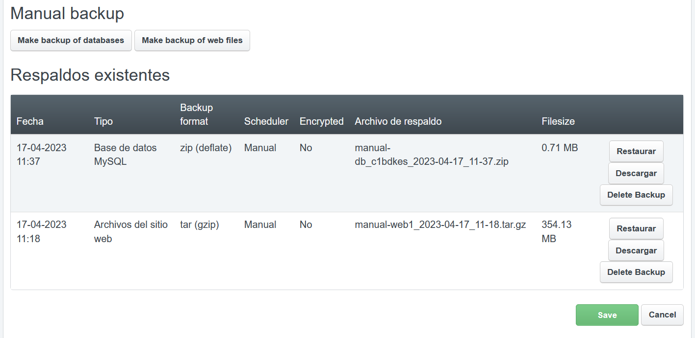

Como vemos en la imagen superior nos aparece el detalle de cada tipo de copia realizada.

## Nota:

En caso de no ver los botones de ***Make backup of databeses*** y ***Make backup of web files*** podemos generar la copia acudiendo a *Intervalo de copia de seguridad* del menú, seleccionando una opción.

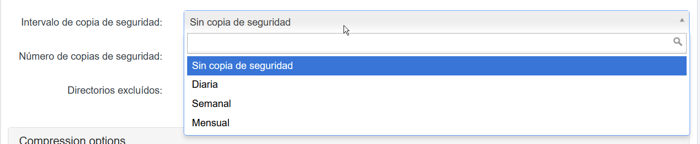

Esperamos al intervalo de tiempo para que se genere la copia, una vez sea generada se debe volver a seleccionar ***Sin copia de seguridad***, dado que esto ocupa recursos en el servidor que puede provocar un mal funcionamiento del sitio.

## Descargar backup

Una vez generado el backup, damos clic sobre el botón ***Descargar***

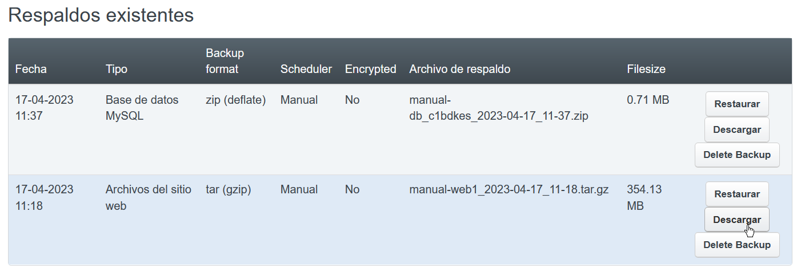

Sin embargo, esta acción no descarga directamente a nuestro equipo la copia de seguridad, pero muestra una notificación:

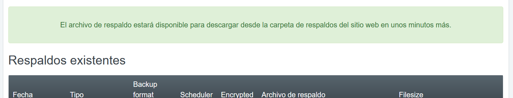

Lo anterior quiere decir que la copia de seguridad se almacenó y para descargarla debemos iniciar sesión a través de un cliente FTP, (Recordemos que en esta ocasión usaremos [FileZilla](https://filezilla-project.org/ "Filezilla")).

### Copiando el backup del sitio web

Una vez abrimos FileZilla, ingresaremos los datos de conexión a nuestro sitio web, dirección IP del servidor donde se encuentra alojada nuestra web, usuario y contraseña del acceso a FTP y por último puerto de conexión.

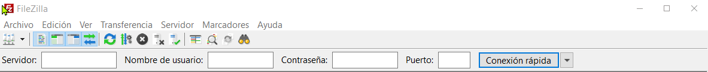

Si se realiza la conexión veremos como en la pantalla de estado nos muestra *Directorio "/" listado correctamente*, así como en el lado derecho en *sitio remoto* veremos la lista de carpetas de nuestro sitio.

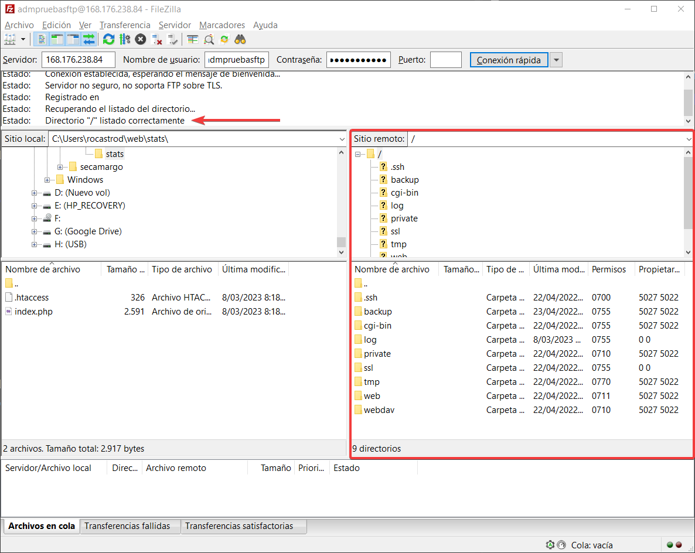

Ahora al lado izquierdo en ***Sitio local*** navegaremos y ubicaremos una carpeta para descargar el backup del sitio web. Como ejemplo, elegiré la carpeta de descargas.

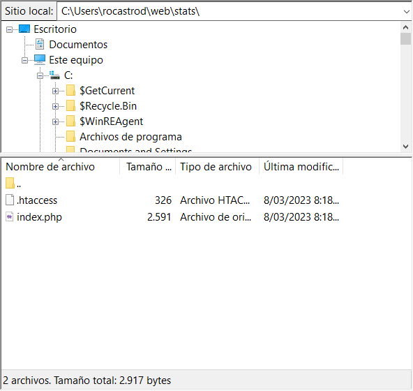

Ahora que ya tenemos la carpeta para descargar el contenido del backup en la sección de ***Sitio remoto***, nos dirigimos a la carpeta ***backup***, donde encontraremos los archivos generados, damos clic derecho y seleccionamos descargar.

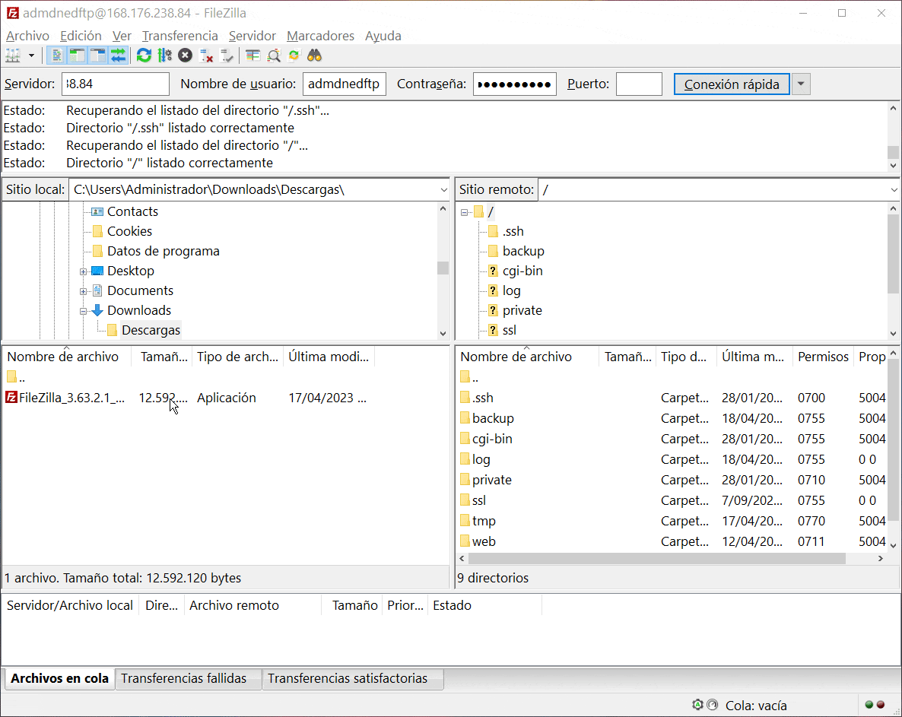

Una vez termina de descargar tenemos en nuestro equipo el backup de nuestro sitio, y es muy importante eliminar los archivos de backup dado que estos archivos consumen recursos del servidor y sitio web, que puede afectar el rendimiento de todos los sitios alojados.

## Eliminar archivos de backup del servidor
Una vez descargamos los archivos desde el cliente FTP, eliminamos los archivos de la carpeta backup.

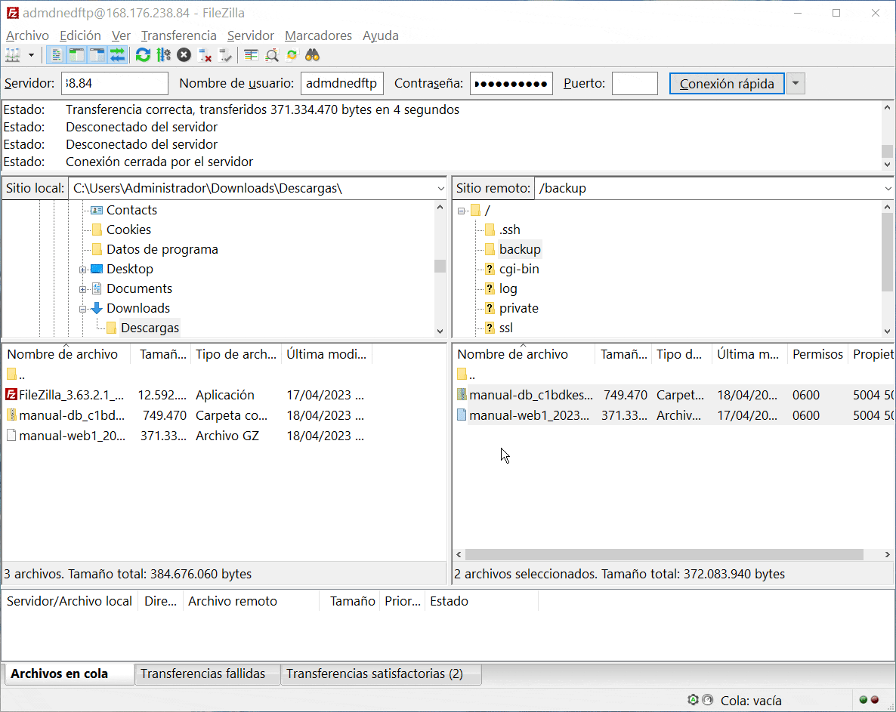

Para terminar de eliminar los archivos de backup nos dirigimos a la administración del sitio y presionamos en el botón de ***Delete Backup***. 

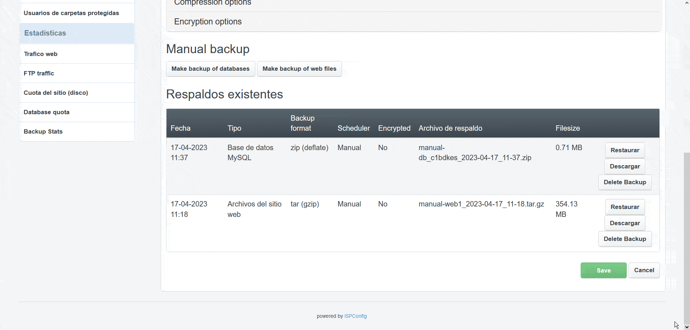